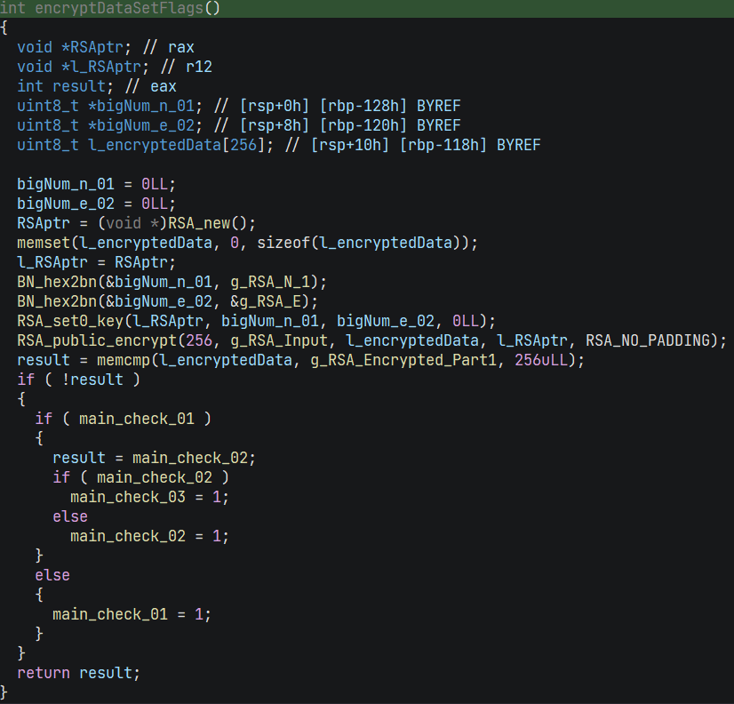

# Solving Hex-Ray's "Madame De Maintenon’s Cryptographic Pursuit – Unmasking the Traitors"


*This is file is a loose walkthrough of notes for solving the CTF*

Tools:
* IDA 7.6 Windows with remote debugging into a Linux VM
* Python

Running the binary we are presented with the following message.

>You have heard rumours that the diary of Madame de Maintenon contained the secrets to a legendary plot.
>Good luck on your journey to uncovering the truth behind this mystery!
>You have heard that a rival historian recently discovered a copy of a chapter of the diary of Madame de Maintenon at the local library. But being unable to solve the mystery, returned it in frustration. Having long been fascinated by her history, you can't wait to investigate. What do you do?

ooo ok, its adventure time :) the binary awaits our input message, let start to reverse the binary and discover what it wants us to input.


The challenge can be broken down into 5 phases

## Phase 1

We need to give an answer to the question "What do you do?"


This is quite simple since its a string compare against "Head to the library"
Although that being said, the the string length check can be slightly confusing and may be distracting at first :)

*Fun fact at address 0x402524 is an unreferenced cleaner version of this check*


## Phase 2

>You locate the section of the library where the diary was rumoured to have been stored, but its place is empty. After a few minutes browsing, you find it! A single page, but one that holds the key to a fascinating mystery.
>The page reads:
>_______________
>21 October 1684
>Dear Diary,
>Today, an unsettling discovery came my way. A letter, it was, with ominous tidings of a plot against our cherished Louis XIV. The message was unlike any other, its meaning hidden behind unfamiliar symbols.
>Within the letter lay a clue, 01000010, a piece of the puzzle. It hinted at more secrets, and I felt compelled to uncover them. But where to find the next piece?
>Yours in devotion,
>Madame De Maintenon
>_______________
>The page was lying on the shelf in the open, maybe it fell from somewhere. You see a few more loose pages sticking out of some other books around you. What happened here?
>What do you do?

ok we got a puzzle piece, lets store that in our inventory `01000010` 

The input validation function for phase 2 is at `0x402560`

Its basically a simple 29 byte xor of our input against `KEY_1` and compared against `KEY_2`

```python
from binascii import unhexlify

KEY_1 = 0x443663C81C2884A08D3A2F39F7EE924FA7D5D36C818C4FCD371789FCF9
KEY_2 = 0x075E06AB7708E6CFE2515C199880B23BCFB0F302E4F43BED447FEC909F

M = KEY_1 ^ KEY_2
M = str(hex(M)).encode()[2:]
print(unhexlify(M).decode('utf-8'))
```
Output: **Check books on the next shelf**

Due to the way the compiler has optimised the data loads into 128bit chunks it can be difficult to read the decompiled code at first, although that being said i'm using a relatively old IDA version, i know some other tools do a much better job at this. 

## Phase 3

>What luck! While going through the books on the next shelf over, you find another page stuck under them, similarly weathered to the first one. The message is hard to decipher due to it's age, but after some careful analysis you manage to decode it.
>
>It reads:
>_______________
>24 October 1684
>
>Beloved Diary,
> 
>As I delved into the code, a new piece surfaced, 00110111. It whispered of hidden truths, yet it also hinted that there was more to uncover. The puzzle remained incomplete.
>
>Yours eternally,
>
>Madame De Maintenon
>_______________
>
>Another clue, what could it mean? And where are the rest?

another piece of the puzzle `00110111`, having 17th century old diaries whispering hidden truths is surely a Dan Brown novel in the making.

The input validation function for phase 3 is at  `0x401300`


Each character of the input is checked against a simple expression, you could use symbolic execution to solve this however in my case i typed in manually the expressions into python, which at the time felt quicker than sidetracking to making tooling

```python
chr(0x62-0x0F&0xFF)
....
```

```
(input_msg_3[0] + 0x0F) == 0x62) -> chr(0x62-0x0F&0xFF) -> 'S'
(input_msg_3[1] ^ 0x3B) == 0x5E) -> chr(0x5E^0x3B&0xFF) -> 'e'
(input_msg_3[2] + 0x39) == 0x9A) -> chr(0x9A-0x39&0xFF) -> 'a'
```

after resolving each character we get **"Search the book for clues"**

## Phase 4

>From the lack of dust on the book you found, it's clear these were recently borrowed. Maybe the pages got mixed up with the books when being reshelved?
>
>You look up the name of the last borrower, and look up what other books they may have checked out. There you find the diary records mentioned, as well as one other book. 
>Finding that book on the shelves yields another page!
>
>_______________
>30 October 1684
>
>Dearest Diary,
>
>Another fragment emerged, 10110010. It was a step closer to the full picture, but it also held a hint. The rest of the location, it suggested, was not far away.
>
>Yours eternally,
>
>Madame De Maintenon
>_______________

we will take note of `10110010`

The input validation function for phase 4 is at  `0x04016F0`

This function sets an AES key of the previous input `Search the book for clues` and decrypts a buffer 0x42BC23270FF2368C9217... this decrypted buffer is compared against our input.

The decrypted buffer contains the message `Turn over the page`

## Phase 5

>Turning the page over, you find the final entry to the diary!
>
>_______________
>9 November 1684
>
>Beloved Diary,
>
>Today, the last piece fell into place, 00000101. With it came the realization that the remaining location lay elsewhere, a mystery yet to be unraveled. Our mission is clear, my dear diary; we must decipher the rest to protect our homeland.
>
>Yours in devotion,
>
>Madame de Maintenon
>_______________
>
>What does this mean? You've worked so hard but yet still don't have the information you seek? What now?
>You have all four pages your rival claimed to have found, and yet are no closer to the truth.
>After several hours of fruitlessly searching for meaning in the messages, you give up and turn to leave in defeat.

After this message the program exits and we are left with 4 pieces of new information.


```
01000010
00110111
10110010
00000101
```

### Where next

up until this point we have been focused on the required inputs for the programs questions, however once we reach phase 5 we can see that this wont be executed unless the following variables are set: `main_check_01` `main_check_02` `main_check_02` (see first image)

Cross referencing these variables we find an interesting function:



This function is called near the end of all `Phase_0X` functions.

The function encrypts some data with RSA and compares it against another buffer, if the buffers match, it then proceeds to set the first `main_check_x` variable that is currently unset.

Its important to note that the buffer encrypted with the supplied public key is always our first input. `Head to the library`

### Studying the RSA function

If you are interested in how the math of RSA works i wrote a beginners guide on this subject some years ago: [A Guide To RSA](https://web.archive.org/web/20181222200613/http://www.woodmann.com/yates/Cryptography/A_Guide_to_RSA_08.pdf)

Lets examine the execution of the first instance of this function.

```
n1  = 0x8e449627141446d50a3bfab5d9f
e1  = 0x3
in  = 0x4865616420746F20746865206C6962726172790000000....
out = 0x0545E01D9A3142B8FEAD8B5B4761A40E146767F03712A....
needed = 0x0x7D9E6B093218080A5A34349C0DB3C3C986B102D9....
```

1. we setup an RSA public key with the above `n1` and `e1`
2. we encrypt the string `in`("Head to the library") -> `out`
3. we check `out` against `needed`

Important things to notice here are that we are encrypting the message string that we first input into the program, however we are encrypting `256` bytes.

Its at this point i realized that the input to the first prompt can contain extra data, for example `Head to the librarydjeuffnehfnfujenfnjdjf` is a valid input, looking closely back again at the phase 1 check this is because the memcmp is fixed against the first 0x13 bytes and not including a null byte.

### Readjusting our focus

Lets take a step back and recollect our thoughts and new goals :)

In order to set the `main_check_01` flag to 1 we must encrypt an unknown message that starts with "Head to the library" such that the encrypted message matches the checked buffer `needed` ... in essence we must decrypt the `needed` buffer to find the required input.

To decrypt the `needed` buffer we would need to break RSA 2048, this seems unfeasible ... but all is not as it seems.

Studying references to the RSA data we can see:

1) The N value can be modified by the function `0x402370` (get text input)
2) The E value is always `3`
3) The PlainText is always the string entered at the first prompt
4) The final Phase 5 message is decrypted via AES using the this first prompt as an AES Key
5)  The `needed` buffer is modified inside `Phase 2` and `Phase 3`

### A change of analysis

Until now we have been very bottom up focused on tracking back needed data, now its time for a more top down analysis in order to collect further information.

An RSA public key consists of N and E, E is always 3 however in this program N is patched a further 2 times if the checks pass.

This means we have 3 public keys.


```
E = 3  
RSA_N_1 = 0x8e449627141446d50a3bfab...  
RSA_N_2 = 0x678dcc64ccf7c29ffe64838...  
RSA_N_3 = 0xb1b751bdef5727862c0f6bd...  
```

The `needed` buffer is also patched during phase 2 and 3

```
NEEDED_1 = 0x7D9E6B093218080A5A34349C0DB3C3C...
NEEDED_2 = 0x67512E54FF9CD853AB645A69EC8F640...
NEEDED_3 = 0x1B48F3DE27DB0A80FFA291B161FFE9C...
```

You can collect these buffers by flipping the check flags 1 by 1 as you debug through the program up to the `RSA_public_encrypt` lines.

### What do we have?

3 public keys, 3 encrypted buffers

we know that the 3 encrypted buffers contain the same message, since these are the `needed` buffers that we compare against our encrypted prompt message.

at this point you may be wondering how the puzzle pieces we collected along the way can help us now, perhapes they are parts of RSA d or phi.


and there is this strange orphan key in the binary.

unfortunately all of this is not relevant and such thoughts are misleading, its really the case that we should try to uncover the extra input of message 1.

at this point it becomes a case of having the necessary knowledge on crypto attacks, searching about attacks will bring up a couple of good candidates but ultimately the best one that fits our situation is a Håstad's Broadcast Attack. 

[script](scripts/solution.py)

Running the attack will give us the new require phase 1 input.  
`Head to the library. Upon entering, politely ask the librarian if they are aware of any extra documents refering to Madame De Maintenon.`

it seems that politeness will get us further in this challenge, as is the case with many things in life^^

now if restart the application and provide the following inputs.

1. Head to the library. Upon entering, politely ask the librarian if they are aware of any extra documents refering to Madame De Maintenon.
2. Check books on the next shelf
3. Search the book for clues
4. Turn over the page

at the end we get this new information.

>As you move to leave, the librarian comes running!
>
>'I found this in the back room for you, it was a page we found lying around after procesing the most recent batch of new books but we weren't sure what it was for! But look at the signature!'
>
>She hands you a fifth, almost completely blank new page. The aging of the paper looks near identical to the other four pages you found from the diary!
>
>All the page says on it is:
>_______________
>
>The other key:
>
>01000000110111000011011000000000
>
>M d. M
>_______________
>
>You thank the librarian, and take your leave. You have much to think on. All these 1's and 0's, how do they encode the location of the final target???
>
>#########################
>
>Congratulations! If you've found all 5 pages of the diary you have everything you need! Convert the values you found into coordinates, (hint: IEEE-754 Floating Point), and send those coordinates in an email to [redacted]
>To locally verify your coordinates, the md5 of the coordinates, with 4 decimal places, (including potential leading zeros) in the form:
>xx.xxxx, yy.yyyy
>Has an md5 of fe72f3730186f24d983a1c2ed1bc1da7 when pasted as a 16 character string into https://www.md5hashgenerator.com/


We are presented with a key `01000000110111000011011000000000` and told its part of some coordinates, from this we can infer that these are Latitude/Longitude coordinates and use the remaining information we got to construction the second part of the coordinate


| Binary | Hex | Decimal | Float |
| ------ | --- | ------- | ----- |
| 01000010001101111011001000000101 | 0x4237B205 | 1110946309 | 45.9238 |
| 01000000110111000011011000000000 | 0x40DC3600 | 1088173568 | 6.88159 |

```
format and hash: "45.9238, 06.8815" -> (fe72f3730186f24d983a1c2ed1bc1da7)

"Chamonix, France"
```

and thats the end of our journey (-:

/Rob.

