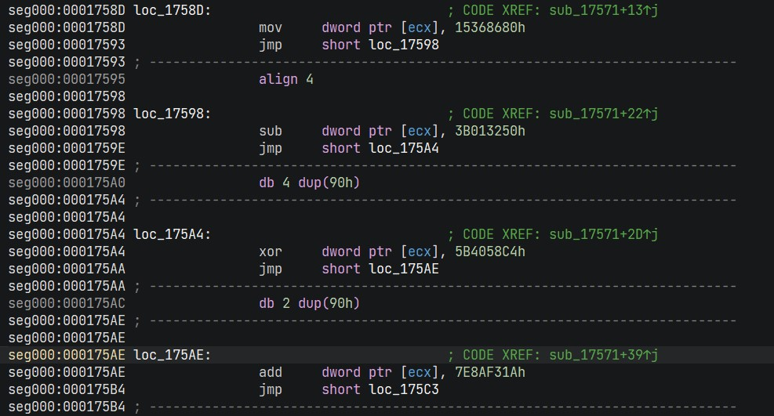
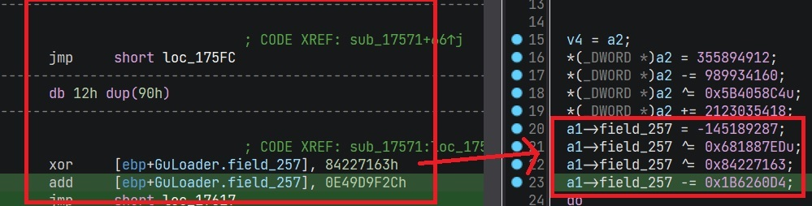
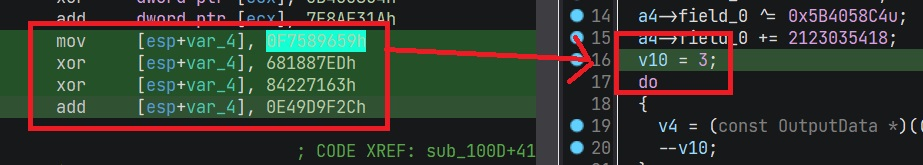

# Some notes about advanced analysis techniques on guloader

1.) how to update the ida veh plugin to generate a cleaner binary  
2.) using concolic execution with triton to obtain the output buffer  
3.) using symolic buffers in triton to extract the algo of the function and rip it into python  
4.) why IDA's constant folding fails and guloaders technique for obfuscating variable access  

## 1. Updating the VEH Plugin Patcher

pan-unit42 have a nice plugin in the form of an ida processor plugin, this is really cool. [Plugin](https://github.com/pan-unit42/public_tools/blob/master/idapython-guloader-anti-analysis/guloader_veh_anti_analysis_.py)

I found that IDA will create cleaner functions and less conflicts in code analysis if you nop out the junk data between the int 3 jmps, i think this is because sometimes the junk code can sometimes disassemble into jumps and create invalid paths and destroy valid code.

simply change the following:

```py
        if b[0] ==0xCC:                             #look for CC byte that trigger VEH
            offset = b[1] ^ 0xA9                    #decode offset value
            idaapi.put_byte(insn.ea, 0xEB)          #patch CC byte with JMP instruction
            idaapi.put_byte(insn.ea+1, offset-2)    #patch encoded offset with decoded offset
            print("Patched bytes at: 0x%X" % insn.ea)
            return True
```

to

```py
        if b[0] ==0xCC:                             #look for CC byte that trigger VEH
            offset = b[1] ^ 0x8F                    #decode offset value
            idaapi.put_byte(insn.ea, 0xEB)          #patch CC byte with JMP instruction
            idaapi.put_byte(insn.ea+1, offset-2)    #patch encoded offset with decoded offset
            for r in range(0, offset-2):
                idaapi.put_byte(insn.ea+r+2, 0x90)
            print("Patched bytes at: 0x%X" % insn.ea)
            return True

        return True
```

Creates a slightly cleaner code look  



## 2. concolic execution via triton to obtain an output buffer

We will take the obfuscated function `0x17571` to demonstrate symbolic analysis techniques.

The obfuscated functions takes a pointer to an output buffer, the size is 0x1000 bytes although no more than 0x20 is used. The function generates some constant key inside the buffer.

`Input -> BlackBox -> Output`

The sample [script 01](01.concolic_execution.py) uses a mixture of symbolic and concrete information to emulate the execution of the function.

we provide: a concrete output buffer/eip value/esp value/a pointer on the stack to the buffer

notice how the code flow takes into account the exception tricks

```py
def set_next_eip(ctx, insn):
    pc = ctx.getConcreteRegisterValue(ctx.registers.eip)
    if insn.getType() == OPCODE.X86.INT3: 
        ctx.setConcreteRegisterValue(ctx.registers.eip, (pc + (code[pc+1]^decode_key)))

```

The output is as follows:

```
[Execute]:[0x00017580] mov ecx, dword ptr [esp + 4]
[Execute]:[0x0001758D] mov dword ptr [ecx], 0x15368680
[Execute]:[0x00017598] sub dword ptr [ecx], 0x3b013250
[Execute]:[0x000175A4] xor dword ptr [ecx], 0x5b4058c4
[Execute]:[0x000175AE] add dword ptr [ecx], 0x7e8af31a
[Execute]:[0x000175C3] mov dword ptr [ebp + 0x257], 0xf7589659
[Execute]:[0x000175CD] xor dword ptr [ebp + 0x257], 0x681887ed
[Execute]:[0x000175FC] xor dword ptr [ebp + 0x257], 0x84227163
[Execute]:[0x00017606] add dword ptr [ebp + 0x257], 0xe49d9f2c
[Execute]:[0x0001761D] inc ecx
[Execute]:[0x0001761E] dec dword ptr [ebp + 0x257]
[Execute]:[0x00017624] jne 0x17617
[Execute]:[0x0001761D] inc ecx
[Execute]:[0x0001761E] dec dword ptr [ebp + 0x257]
[Execute]:[0x00017624] jne 0x17617
[Execute]:[0x0001761D] inc ecx
[Execute]:[0x0001761E] dec dword ptr [ebp + 0x257]
[Execute]:[0x00017624] jne 0x17617
[Execute]:[0x00017634] inc ecx
[Execute]:[0x00017641] mov dword ptr [ecx], 0x3a5b156c
[Execute]:[0x00017653] xor dword ptr [ecx], 0x9ec855ce
[Execute]:[0x00017665] xor dword ptr [ecx], 0x9fa33361
[Execute]:[0x0001766B] xor dword ptr [ecx], 0x56523c89
[Execute]:[0x0001768E] mov dword ptr [ebp + 0x263], esi
[Execute]:[0x000176A2] mov esi, 0x578ef0c8
[Execute]:[0x000176AD] xor esi, 0x330a1581
[Execute]:[0x000176C1] xor esi, 0x62865d26
[Execute]:[0x000176DB] add esi, 0xf9fd4795
[Execute]:[0x000176E1] jmp 0x1772b
[Execute]:[0x00017734] add ecx, esi
[Execute]:[0x00017736] mov esi, dword ptr [ebp + 0x263]
[Execute]:[0x0001774E] mov dword ptr [ecx], 0xde864075
[Execute]:[0x0001775E] xor dword ptr [ecx], 0x77e9cf51
[Execute]:[0x00017775] xor dword ptr [ecx], 0x35bb6508
[Execute]:[0x0001777B] xor dword ptr [ecx], 0x57e8b5c6
[Execute]:[0x00017785] mov dword ptr [ebp + 0x274], 0x23af3613
[Execute]:[0x00017798] xor dword ptr [ebp + 0x274], 0x234ab211
[Execute]:[0x000177B4] xor dword ptr [ebp + 0x274], 0x9ca70fad
[Execute]:[0x000177BE] add dword ptr [ebp + 0x274], 0x63bd7454
[Execute]:[0x000177C8] inc ecx
[Execute]:[0x000177C9] dec dword ptr [ebp + 0x274]
[Execute]:[0x000177CF] jne 0x177c8
[Execute]:[0x000177C8] inc ecx
[Execute]:[0x000177C9] dec dword ptr [ebp + 0x274]
[Execute]:[0x000177CF] jne 0x177c8
[Execute]:[0x000177C8] inc ecx
[Execute]:[0x000177C9] dec dword ptr [ebp + 0x274]
[Execute]:[0x000177CF] jne 0x177c8
[Execute]:[0x000177E6] inc ecx
[Execute]:[0x00017809] mov dword ptr [ecx], 0x91d287ca
[Execute]:[0x0001782E] add dword ptr [ecx], 0x6570a66f
[Execute]:[0x00017840] xor dword ptr [ecx], 0x77465d8c
[Execute]:[0x0001785C] xor dword ptr [ecx], 0x1a39f724
[Execute]:[0x0001787A] mov dword ptr [ebp + 0x22a], 0xf35c5dec
[Execute]:[0x00017897] xor dword ptr [ebp + 0x22a], 0x43f0e8ae
[Execute]:[0x000178AA] sub dword ptr [ebp + 0x22a], 0x17364370
[Execute]:[0x000178C7] xor dword ptr [ebp + 0x22a], 0x997671d1
[Execute]:[0x00017911] inc ecx
[Execute]:[0x00017912] dec dword ptr [ebp + 0x22a]
[Execute]:[0x00017918] jne 0x17903
[Execute]:[0x00017911] inc ecx
[Execute]:[0x00017912] dec dword ptr [ebp + 0x22a]
[Execute]:[0x00017918] jne 0x17903
[Execute]:[0x00017911] inc ecx
[Execute]:[0x00017912] dec dword ptr [ebp + 0x22a]
[Execute]:[0x00017918] jne 0x17903
[Execute]:[0x0001792D] inc ecx
[Execute]:[0x00017949] mov dword ptr [ecx], 0x958fdfc7
[Execute]:[0x0001795F] xor dword ptr [ecx], 0xe31e3d52
[Execute]:[0x00017986] xor dword ptr [ecx], 0x1aba865c
[Execute]:[0x0001799D] add dword ptr [ecx], 0x93d4f2c5
[Execute]:[0x000179AF] mov dword ptr [ebp + 0x245], ebx
[Execute]:[0x000179B5] mov ebx, 0x1acdfd3e
[Execute]:[0x000179BA] xor ebx, 0x60c745e8
[Execute]:[0x000179C0] xor ebx, 0x9a7b0dfb
[Execute]:[0x000179D8] xor ebx, 0xe071b529
[Execute]:[0x000179EE] add ecx, ebx
[Execute]:[0x000179F0] mov ebx, dword ptr [ebp + 0x245]
[Execute]:[0x00017A11] ret
----------------------------

[STATE]:
eip:32 bv[31..0] ref_636 = ((((0x0) << 8 | 0x0) << 8 | 0x0) << 8 | 0x0) # Program Counter
ebx:32 bv[31..0] ref_634 = 0x0 # MOV operation
af:1 bv[0..0] ref_627 = (0x1 if (0x10 == (0x10 & (ref_626 ^ (ref_545 ^ ref_619)))) else 0x0) # Adjust flag
ecx:32 bv[31..0] ref_626 = ((ref_545 + ref_619) & 0xffffffff) # ADD operation
esi:32 bv[31..0] ref_241 = 0x0 # MOV operation
cf:1 bv[0..0] ref_628 = ((((ref_545 & ref_619) ^ (((ref_545 ^ ref_619) ^ ref_626) & (ref_545 ^ ref_619))) >> 31) & 0x1) # Carry flag
sf:1 bv[0..0] ref_631 = ((ref_626 >> 31) & 0x1) # Sign flag
esp:32 bv[31..0] ref_637 = ((0x7ffffffb + 0x4) & 0xffffffff) # Stack alignment
of:1 bv[0..0] ref_629 = ((((ref_545 ^ (~(ref_619) & 0xffffffff)) & (ref_545 ^ ref_626)) >> 31) & 0x1) # Overflow flag
pf:1 bv[0..0] ref_630 = ((((((((0x1 ^ (ref_626 & 0x1)) ^ ((ref_626 >> 1) & 0x1)) ^ ((ref_626 >> 2) & 0x1)) ^ ((ref_626 >> 3) & 0x1)) ^ ((ref_626 >> 4) & 0x1)) ^ ((ref_626 >> 5) & 0x1)) ^ ((ref_626 >> 6) & 0x1)) ^ ((ref_626 >> 7) & 0x1)) # Parity flag
zf:1 bv[0..0] ref_632 = (0x1 if (ref_626 == 0x0) else 0x0) # Zero flag
----------------------------

[OUPUT]:
b'\x0e\x00\x00\x00JObm\xea_<\xcb\x91\x84<\x9a\x8eW\x00\x00\x00\x00\x00\x00'
```

The final output buffer contains the key.

## 2. Symbolic buffer and algorithm extraction

Ok lets do something more cool :), what if we could extract the whole algorithm of the function for our own need, this is what symbolic execution allows, put simply symbolic execution allows you to generate expressions for certan things based on certain steps of execution.

[script 02](02.expresion_extraction.py) allows this, here is the output.


```py
[Expression used to generate output data]
----------------------------------------

((((((((((((((((((((((((((((((((((output_buffer >> 248) & 0xff)) << 8 | ((output_buffer >> 240) & 0xff)) << 8 | ((output_buffer >> 232) & 0xff)) << 8 | ((output_buffer >> 224) & 0xff)) << 8 | ((output_buffer >> 216) & 0xff)) << 8 | ((output_buffer >> 208) & 0xff)) << 8 | ((output_buffer >> 200) & 0xff)) << 8 | ((output_buffer >> 192) & 0xff)) << 8 | ((output_buffer >> 184) & 0xff)) << 8 | ((output_buffer >> 176) & 0xff)) << 8 | ((output_buffer >> 168) & 0xff)) << 8 | ((output_buffer >> 160) & 0xff)) << 8 | ((((((0x958fdfc7 ^ 0xe31e3d52) ^ 0x1aba865c) + 0x93d4f2c5) & 0xffffffff) >> 24) & 0xff)) << 8 | ((((((0x958fdfc7 ^ 0xe31e3d52) ^ 0x1aba865c) + 0x93d4f2c5) & 0xffffffff) >> 16) & 0xff)) << 8 | ((((((0x958fdfc7 ^ 0xe31e3d52) ^ 0x1aba865c) + 0x93d4f2c5) & 0xffffffff) >> 8) & 0xff)) << 8 | (((((0x958fdfc7 ^ 0xe31e3d52) ^ 0x1aba865c) + 0x93d4f2c5) & 0xffffffff) & 0xff)) << 8 | ((((((0x91d287ca + 0x6570a66f) & 0xffffffff) ^ 0x77465d8c) ^ 0x1a39f724) >> 24) & 0xff)) << 8 | ((((((0x91d287ca + 0x6570a66f) & 0xffffffff) ^ 0x77465d8c) ^ 0x1a39f724) >> 16) & 0xff)) << 8 | ((((((0x91d287ca + 0x6570a66f) & 0xffffffff) ^ 0x77465d8c) ^ 0x1a39f724) >> 8) & 0xff)) << 8 | (((((0x91d287ca + 0x6570a66f) & 0xffffffff) ^ 0x77465d8c) ^ 0x1a39f724) & 0xff)) << 8 | (((((0xde864075 ^ 0x77e9cf51) ^ 0x35bb6508) ^ 0x57e8b5c6) >> 24) & 0xff)) << 8 | (((((0xde864075 ^ 0x77e9cf51) ^ 0x35bb6508) ^ 0x57e8b5c6) >> 16) & 0xff)) << 8 | (((((0xde864075 ^ 0x77e9cf51) ^ 0x35bb6508) ^ 0x57e8b5c6) >> 8) & 0xff)) << 8 | ((((0xde864075 ^ 0x77e9cf51) ^ 0x35bb6508) ^ 0x57e8b5c6) & 0xff)) << 8 | (((((0x3a5b156c ^ 0x9ec855ce) ^ 0x9fa33361) ^ 0x56523c89) >> 24) & 0xff)) << 8 | (((((0x3a5b156c ^ 0x9ec855ce) ^ 0x9fa33361) ^ 0x56523c89) >> 16) & 0xff)) << 8 | (((((0x3a5b156c ^ 0x9ec855ce) ^ 0x9fa33361) ^ 0x56523c89) >> 8) & 0xff)) << 8 | ((((0x3a5b156c ^ 0x9ec855ce) ^ 0x9fa33361) ^ 0x56523c89) & 0xff)) << 8 | (((((((0x15368680 - 0x3b013250) & 0xffffffff) ^ 0x5b4058c4) + 0x7e8af31a) & 0xffffffff) >> 24) & 0xff)) << 8 | (((((((0x15368680 - 0x3b013250) & 0xffffffff) ^ 0x5b4058c4) + 0x7e8af31a) & 0xffffffff) >> 16) & 0xff)) << 8 | (((((((0x15368680 - 0x3b013250) & 0xffffffff) ^ 0x5b4058c4) + 0x7e8af31a) & 0xffffffff) >> 8) & 0xff)) << 8 | ((((((0x15368680 - 0x3b013250) & 0xffffffff) ^ 0x5b4058c4) + 0x7e8af31a) & 0xffffffff) & 0xff))
```

you have may notice those familiar constants 0x93d4f2c5/0x77e9cf51/... etc from the function.  
so what can we do with this? well first lets clean it up, uncomment the line `#ctx.setMode(MODE.CONSTANT_FOLDING, True)` in the script.

Triton has many cool analysis features, from expression simplification, dead code removal and more, but anyway after we enable constant folding on the ASTs we now get this

```py
((((((((((((((((((((((((((((((((((output_buffer >> 248) & 0xff)) << 8 | ((output_buffer >> 240) & 0xff)) << 8 | ((output_buffer >> 232) & 0xff)) << 8 | ((output_buffer >> 224) & 0xff)) << 8 | ((output_buffer >> 216) & 0xff)) << 8 | ((output_buffer >> 208) & 0xff)) << 8 | ((output_buffer >> 200) & 0xff)) << 8 | ((output_buffer >> 192) & 0xff)) << 8 | ((output_buffer >> 184) & 0xff)) << 8 | ((output_buffer >> 176) & 0xff)) << 8 | ((output_buffer >> 168) & 0xff)) << 8 | ((output_buffer >> 160) & 0xff)) << 8 | 0x0) << 8 | 0x0) << 8 | 0x57) << 8 | 0x8e) << 8 | 0x9a) << 8 | 0x3c) << 8 | 0x84) << 8 | 0x91) << 8 | 0xcb) << 8 | 0x3c) << 8 | 0x5f) << 8 | 0xea) << 8 | 0x6d) << 8 | 0x62) << 8 | 0x4f) << 8 | 0x4a) << 8 | 0x0) << 8 | 0x0) << 8 | 0x0) << 8 | 0xe)
```

its a bit more compact and concise, and expresses the behavior of the obfuscated function in a fairly simple expression.  

now we can use this in own code like so.


```py
output_buffer = 0
data = ((((((((((((((((((((((((((((((((((output_buffer >> 248) & 0xff)) << 8 | ((output_buffer >> 240) & 0xff)) << 8 | ((output_buffer >> 232) & 0xff)) << 8 | ((output_buffer >> 224) & 0xff)) << 8 | ((output_buffer >> 216) & 0xff)) << 8 | ((output_buffer >> 208) & 0xff)) << 8 | ((output_buffer >> 200) & 0xff)) << 8 | ((output_buffer >> 192) & 0xff)) << 8 | ((output_buffer >> 184) & 0xff)) << 8 | ((output_buffer >> 176) & 0xff)) << 8 | ((output_buffer >> 168) & 0xff)) << 8 | ((output_buffer >> 160) & 0xff)) << 8 | 0x0) << 8 | 0x0) << 8 | 0x57) << 8 | 0x8e) << 8 | 0x9a) << 8 | 0x3c) << 8 | 0x84) << 8 | 0x91) << 8 | 0xcb) << 8 | 0x3c) << 8 | 0x5f) << 8 | 0xea) << 8 | 0x6d) << 8 | 0x62) << 8 | 0x4f) << 8 | 0x4a) << 8 | 0x0) << 8 | 0x0) << 8 | 0x0) << 8 | 0xe)
print(hex(data))
```

which gives us our output buffer data.
`0x578e9a3c8491cb3c5fea6d624f4a0000000e`

## 4. guloaders technique for obfuscating variable access

Here is some analysis on how guloader obfuscates code.
First we must understand our target function by hand, here is the code.

```py
mov ecx, [esp+4h]

;==========================================================
; Write 4 bytes of data
mov     dword [ecx], 15368680h
sub     dword [ecx], 3B013250h
xor     dword [ecx], 5B4058C4h
add     dword [ecx], 7E8AF31Ah
; Increment buffer(obfuscated)
mov     dword [ebp+257h], 0F7589659h
xor     dword [ebp+257h], 681887EDh
xor     dword [ebp+257h], 84227163h
add     dword [ebp+257h], 0E49D9F2Ch
loop_1:
inc ecx
dec     dword [ebp+257h]
jnz loop_1
inc ecx
;==========================================================
; Write 4 bytes of data
mov     dword [ecx], 3A5B156Ch
xor     dword [ecx], 9EC855CEh
xor     dword [ecx], 9FA33361h
xor     dword [ecx], 56523C89h
; Increment buffer(obfuscated)
mov     [ebp+263h], esi
mov     esi, 578EF0C8h
xor     esi, 330A1581h
xor     esi, 62865D26h
add     esi, 0F9FD4795h
add     ecx, esi
mov     esi, [ebp+263h]
;==========================================================
; Write 4 bytes of data
mov     dword [ecx], 0DE864075h
xor     dword [ecx], 77E9CF51h
xor     dword [ecx], 35BB6508h
xor     dword [ecx], 57E8B5C6h
; Increment buffer(obfuscated)
mov     dword [ebp+274h], 23AF3613h
xor     dword [ebp+274h], 234AB211h
xor     dword [ebp+274h], 9CA70FADh
add     dword [ebp+274h], 63BD7454h
loop_2:
inc ecx
dec     dword [ebp+274h]
jnz loop_2
inc ecx
;==========================================================
; Write 4 bytes of data
mov     dword [ecx], 91D287CAh
add     dword [ecx], 6570A66Fh
xor     dword [ecx], 77465D8Ch
xor     dword [ecx], 1A39F724h
; Increment buffer(obfuscated)
mov     dword [ebp+22Ah], 0F35C5DECh
xor     dword [ebp+22Ah], 43F0E8AEh
sub     dword [ebp+22Ah], 17364370h
xor     dword [ebp+22Ah], 997671D1h
loop_3:
inc ecx
dec dword [ebp+22Ah]
jnz loop_3
inc ecx
;==========================================================
; Write 4 bytes of data
mov     dword [ecx], 958FDFC7h
xor     dword [ecx], 0E31E3D52h
xor     dword [ecx], 1ABA865Ch
add     dword [ecx], 93D4F2C5h
; Increment buffer(obfuscated)
mov     [ebp+245h], ebx
mov     ebx, 1ACDFD3Eh
xor     ebx, 60C745E8h
xor     ebx, 9A7B0DFBh
xor     ebx, 0E071B529h
add     ecx, ebx
mov     ebx, [ebp+245h]
;==========================================================
ret
;--------------------------------------------------------------------------------------------
```

it writes 5 dwords of data into the output buffer pointer to by `ecx`, we can observe the following.

1.) each dword written value is generated by a unfolded constant  
2.) the buffer of the ecx pointer is increment by 4, the value 4 is also generated using a folded constant and the increment is done using a small loop or an add instruction  
3.) there is a mysterious global ebp register used through out all functions in guloader  

The reason IDA cant, or rather wont fold constants, is because the target memory areas are not scope bound, and it appears this is required.

for example the output buffer is a pointer outside the function, same with ebp.

infact ebp is a kind of scratch stack, look how it is used as temporary storage !

```
mov     [ebp+245h], ebx
mov     ebx, 1ACDFD3Eh
xor     ebx, 60C745E8h
xor     ebx, 9A7B0DFBh
xor     ebx, 0E071B529h
add     ecx, ebx
mov     ebx, [ebp+245h]
```

The register EBX is saved, then used and restored, this causes som chaos in th analysis.
We would need to rewrite the microcode to convert such stores to stack variables.

for example:

before:



after:



in theory a way to tackle this obfuscation would be to hook into the decompiler process and convert ebp access into local stack variables.


Anyway, the above is just some general educational analysis info and not meant to be some kind of targeted general solution, and if you find it fun to create analysis tools and ideas like i do then with enough effort things are indeed possible.

